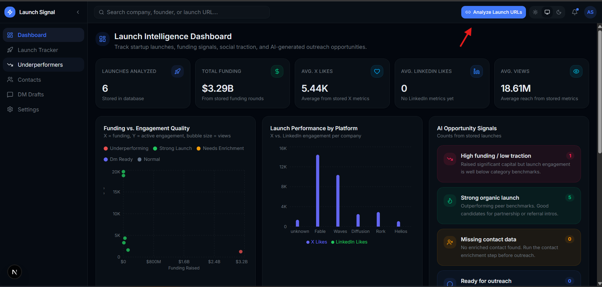
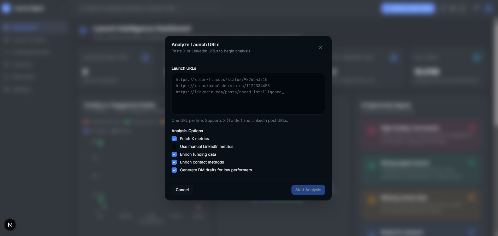
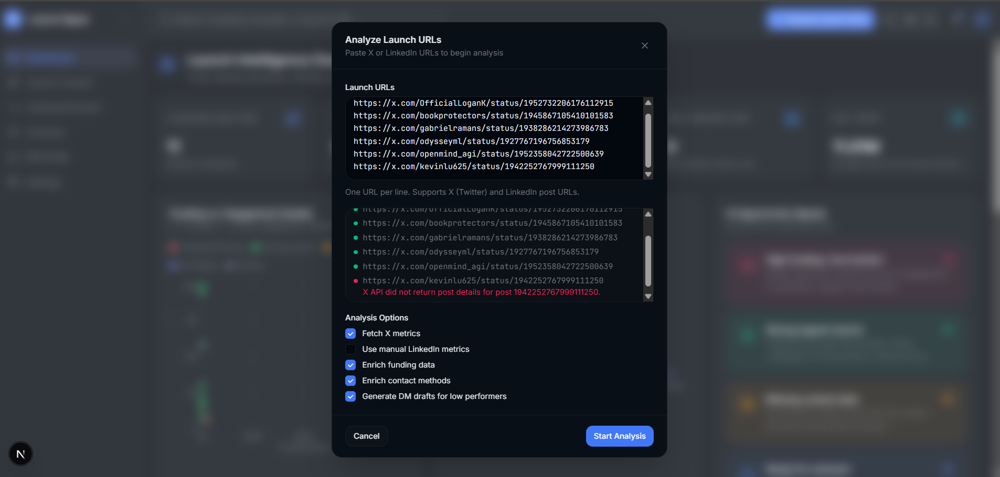
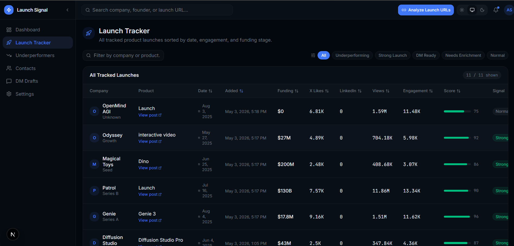
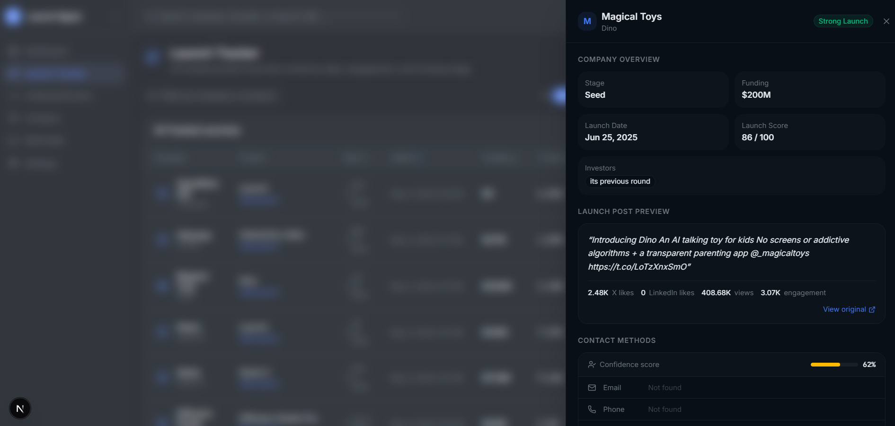
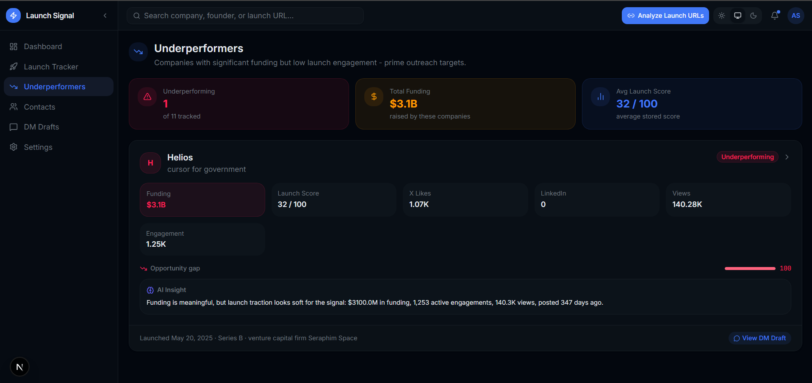
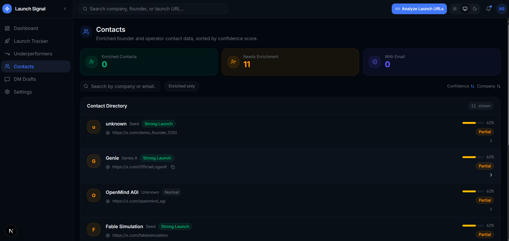
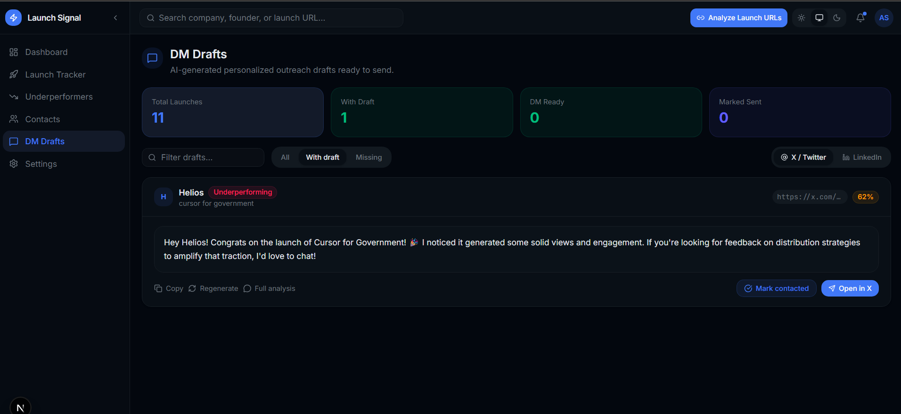

# Launch Signal Dashboard

Launch Signal Dashboard is a technical assessment MVP for finding startup launches where public launch traction does not match the company's funding signal.

The app imports launch post URLs, enriches each company with funding and contact data, scores the launch, and generates outreach-ready DM drafts when the launch appears underperforming.

For the assessment submission, I also provided a deployed Vercel link in the email so the reviewers can run a live test without setting up the project locally.

## What Was Built

- Import one or many X or LinkedIn launch URLs.
- Detect the launch platform and extract the X post ID when applicable.
- Fetch live X post details and social metrics when `X_BEARER_TOKEN` is configured.
- Support LinkedIn in a manual/hybrid mode because LinkedIn API access is restricted and the app does not scrape LinkedIn.
- Use OpenAI to extract company/product information, analyze launch performance, and draft outreach messages.
- Use Tavily instead of Crunchbase to search the web for public funding announcements and contact methods.
- Persist companies, launches, funding rounds, metrics, contacts, DM drafts, and per-URL analysis logs in Supabase Postgres through Prisma.
- Show dashboard sections for AI signals, launch tracking, underperformers, contacts, DM drafts, settings, and table pagination.
- Track import progress across batches, for example `1/5`, `2/5`, and show which URLs succeeded or failed.
- Avoid saving demo external data in live mode when an API call fails. Failures are reported per URL with a clear reason.

## Bonus Coverage

Both bonus requirements are implemented:

- **Bonus: enriched contact methods.** The app stores contact methods in the database with type, value, source, and confidence. It supports email, phone, LinkedIn, X, and website records. In live mode, it does not invent personal phone numbers. It stores contacts from safe sources such as the input URL, extracted profile/company data when available, domain inference, or manually added/public data.
- **Double bonus: DM drafts for poor launches.** When a launch is classified as `UNDERPERFORMING`, the app generates X and LinkedIn DM drafts with OpenAI. The DM Drafts screen can be filtered to show launches with or without drafts.

## Architecture

The project uses:

- **Next.js App Router** for the application and API routes.
- **TypeScript** for type-safe services, API contracts, and dashboard data mapping.
- **Prisma** as the database ORM.
- **Supabase PostgreSQL** as the persistent database.
- **OpenAI API** for structured extraction, launch analysis, and DM generation.
- **X API** for live launch post details and metrics.
- **Tavily API** for public web search over startup funding announcements and contact sources.
- **LinkedIn manual/hybrid mode** because the public LinkedIn API is permission-gated.

Key files:

- `prisma/schema.prisma` - database schema for companies, launches, metrics, funding, contacts, drafts, and analysis runs.
- `app/api/import-launches/route.ts` - main import and enrichment pipeline.
- `app/api/launches/route.ts` - dashboard data endpoint.
- `app/api/companies/[id]/route.ts` - company detail endpoint.
- `app/api/dm-drafts/generate/route.ts` - on-demand DM generation endpoint.
- `app/api/settings/route.ts` - system/API readiness and database counts.
- `services/x.ts` - X post parsing, details, and metrics fetching.
- `services/funding.ts` - Tavily-powered funding enrichment.
- `services/tavily.ts` - Tavily Search API wrapper.
- `services/contacts.ts` - safe contact enrichment.
- `services/ai.ts` and `services/prompts.ts` - OpenAI JSON calls and prompts.
- `utils/scoring.ts` - deterministic score and signal classification logic.
- `lib/api-serializers.ts` - Prisma-to-dashboard DTO mapping.

## Data Model

The Prisma schema includes the assessment entities:

- `Company`
- `Launch`
- `FundingRound`
- `SocialMetric`
- `ContactMethod`
- `DmDraft`
- `AnalysisRun`

The `Launch` table also stores computed fields used by the dashboard:

- `launchScore`
- `signal`
- `performanceReason`
- `outreachAngle`
- `createdAt`
- `updatedAt`

`SocialMetric` stores likes, comments, reposts, views, collection source, and collection time.

## Import Flow

When URLs are submitted:

1. The API creates one `AnalysisRun` per URL so logs are isolated per imported link.
2. The platform is detected as X, LinkedIn, or Other.
3. X URLs are parsed for post ID and author handle.
4. X post details and metrics are fetched through the X API when available.
5. LinkedIn URLs are stored without scraping. Metrics must come from manual input or demo mode.
6. OpenAI extracts the likely company name, product name, summary, industry, and confidence.
7. Prisma matches or creates the `Company`.
8. Tavily searches for public funding announcements, then the app parses amount, round, investors, announcement date, source URL, and confidence.
9. Tavily runs a second search for public company contact methods, then contact enrichment stores safe contacts from Tavily, known/manual/public/input sources, and domain inference.
10. The launch is scored using funding, likes, comments, reposts, views, and post age.
11. If the launch is underperforming, OpenAI generates X and LinkedIn DM drafts.
12. The dashboard refreshes with the imported rows and per-URL success/failure results.

## API Keys Used For The Assessment

For the submitted test version, I configured limited API keys for X, OpenAI, and Tavily. They are intentionally limited for assessment use.

- `X_BEARER_TOKEN` - used to fetch public X post details and social metrics such as likes, replies, reposts, and views when available.
- `OPENAI_API_KEY` - used to return structured JSON for company/product extraction, performance analysis, and DM draft generation.
- `TAVILY_API_KEY` - used to search the public web for funding announcements and contact methods. Tavily searches use `search_depth: "advanced"`, `include_answer: "advanced"`, and `max_results: 10`.
- `DATABASE_URL` and `DIRECT_URL` - used by Prisma to connect to the Supabase PostgreSQL database.

The app logs the data source for each step. Successful live calls are labeled as `API`, `OPENAI`, or `TAVILY`. Fallback or manual paths are labeled separately so reviewers can tell how each datapoint was produced.

## Environment Variables

Create `.env` from `.env.example`:

```bash
DATABASE_URL=
DIRECT_URL=
OPENAI_API_KEY=
OPENAI_MODEL=gpt-4o-mini
X_BEARER_TOKEN=
TAVILY_API_KEY=
DEMO_MODE=false
```

Recommended review mode:

- Use `DEMO_MODE=false` for a live assessment run.
- With `DEMO_MODE=false`, failed X or Tavily calls do not create fake demo metrics or fake demo funding.
- With `DEMO_MODE=true`, the app can still be demonstrated without live API keys by using deterministic demo data.

## How To Run Locally

Install dependencies:

```bash
npm install
```

Generate Prisma Client:

```bash
npm run prisma:generate
```

Push the schema to Supabase/Postgres:

```bash
npm run prisma:push
```

Start the development server:

```bash
npm run dev
```

Open:

```text
http://localhost:3000
```

For a production build:

```bash
npm run build
npm run start
```

## How To Test The MVP

1. Open the dashboard.
2. Click **Analyze Launch URLs** in the top navigation.
3. Paste one or multiple launch URLs, one per line.
4. Keep X metrics, funding enrichment, contact enrichment, and DM draft generation enabled.
5. Start the analysis.
6. Review the per-link progress and result summary.
7. Open the Launch Tracker, Underperformers, Contacts, and DM Drafts sections.

If one URL fails and the others succeed, the modal keeps the result summary visible and the primary action changes to `Finish`, making it clear that the successful URLs were still imported.

## Product Walkthrough

### 1. Analyze Launch URLs Button

The primary entry point is the **Analyze Launch URLs** button in the top navigation.



### 2. Import Modal

The modal accepts multiple launch URLs and lets the reviewer choose which enrichment steps to run.



### 3. Batch Progress And Partial Failure Handling

The import flow shows progress per URL and records whether each link succeeded or failed. A failed URL does not block successful URLs from being saved.



### 4. Launch Tracker

The Launch Tracker table shows imported launches with funding, likes, views, engagement, score, status, and created date. Tables include pagination for easier review with larger datasets.



### 5. Launch Detail Drawer

Clicking a launch opens a detail drawer with deeper company, funding, social, contact, AI analysis, and draft information. The drawer can be scrolled for additional details.



### 6. Underperformers

The Underperformers screen focuses on launches where funding or reach looks stronger than active engagement.



### 7. Contacts

The Contacts screen shows enriched company contact methods and confidence. Contact records can come from safe manual/public data, extracted input URLs, X/LinkedIn profile links, or domain inference. When a source is not available, the app avoids inventing private contact information.



### 8. DM Drafts

The DM Drafts screen shows generated outreach copy and can be filtered by launches that already have drafts or still need drafts.



## API Reference

### Import Launches

`POST /api/import-launches`

```json
{
  "urls": ["https://x.com/example/status/1234567890"],
  "options": {
    "fetchXMetrics": true,
    "enrichFunding": true,
    "enrichContacts": true,
    "generateDmDrafts": true
  }
}
```

Response includes:

- `analysisRunIds`
- imported count
- per-URL `results`
- imported launch rows

### List Launches

`GET /api/launches`

Returns launches with company, latest metrics, funding, contacts, DM drafts, and dashboard KPIs.

### Company Detail

`GET /api/companies/:id`

Returns company metadata, funding rounds, contact methods, and launches.

### Generate DM Draft

`POST /api/dm-drafts/generate`

```json
{
  "launchId": "launch_id",
  "platform": "X",
  "tone": "warm"
}
```

## Scoring Methodology

The launch score combines deterministic scoring with OpenAI analysis.

The deterministic baseline considers:

- funding amount
- X likes
- LinkedIn likes
- comments
- reposts
- views
- post age
- active engagement
- view-to-engagement conversion

The signal can be:

- `UNDERPERFORMING`
- `STRONG_LAUNCH`
- `NEEDS_DATA`
- `READY_FOR_OUTREACH`
- `NORMAL`

OpenAI receives the metrics, funding context, post text, post age, and baseline heuristic, then returns a structured JSON analysis with a score, signal, reason, and outreach angle.

## LinkedIn Approach

LinkedIn is intentionally hybrid/manual in this MVP.

The app does not scrape LinkedIn or bypass API permissions. LinkedIn URLs can be stored and analyzed, but live LinkedIn metrics should be supplied manually or added later through an approved data provider.

This keeps the implementation review-friendly and compliant with platform restrictions.

## Notes And Tradeoffs

- Tavily is used instead of Crunchbase so the MVP can search public funding announcements and public contact sources without requiring a paid company database integration.
- Funding enrichment includes a source URL and confidence score when Tavily finds a usable result.
- Live mode avoids saving demo X/funding data when a provider fails.
- AI fallback logic is deterministic and clearly logged as `FALLBACK` if OpenAI is unavailable.
- Contact enrichment is conservative and avoids inventing private founder phone numbers.
- The app is intentionally MVP-friendly: no background queues or auth layer yet, but the service boundaries are ready for that.

## Future Improvements

- Add authenticated workspaces and role-based access.
- Add background jobs for enrichment retries and scheduled metric refreshes.
- Add manual LinkedIn metrics fields directly in the import modal.
- Add source attribution links beside every enriched datapoint.
- Add a contact provider integration for verified emails and public company phone numbers.
- Add CRM export, webhooks, and outreach status syncing.
- Add tests for URL parsing, scoring, Tavily parsing, API routes, and serializer behavior.
